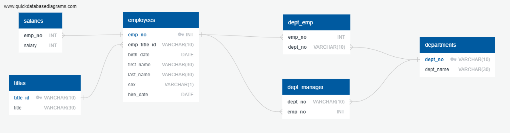

# Module9_SQL-Challenge
SQL Challenge - Week 9 - Data Analytics Boot Camp - University of Oregon

## Background
It’s been two weeks since you were hired as a new data engineer at Pewlett Hackard (a fictional company). Your first major task is to do a research project about people whom the company employed during the 1980s and 1990s. All that remains of the employee database from that period are six CSV files.

For this project, I designed the tables to hold the data from the CSV files, import the CSV files into a SQL database, and then answer questions about the data. That is, you’ll perform data modeling, data engineering, and data analysis, respectively.

## Data Modeling
I used [QuickDBD](https://app.quickdatabasediagrams.com/) to create an ERD diagram for all 6 data files.    View the source diagram at:":  https://app.quickdatabasediagrams.com/#/d/OgcunW

## Data Engineering

I used QuickDB to design the schema for the six provided CSV data files, outlining data types, primary keys, foreign keys and relationships. After exporting the schema from QuickDB, I used the generated code to create the necessary tables in PostgreSQL. I, then imported the CSV files to populate the table values. To ensure proper data validation by foreign keys, I imported the data in the following order:
1. titles
2. employees
3. departments
4. salaries
5. dept_emp
6. dept_manager

## Data Analysis

1. List the employee number, last name, first name, sex, and salary of each employee.

`
SELECT emp.emp_no,
	emp.last_name, 
	emp.first_name,
	emp.sex,
	sal.salary

FROM employees as emp
LEFT JOIN salaries as sal
	ON emp.emp_no = sal.emp_no
;
`

2. List the first name, last name, and hire date for the employees who were hired in 1986.

`code`

3. List the manager of each department along with their department number, department name, employee number, last name, and first name.

`code`

4. List the department number for each employee along with that employee’s employee number, last name, first name, and department name.

`code`

5. List first name, last name, and sex of each employee whose first name is Hercules and whose last name begins with the letter B.

`code`

6. List each employee in the Sales department, including their employee number, last name, and first name.

`code`

7. List each employee in the Sales and Development departments, including their employee number, last name, first name, and department name.

`code`

8. List the frequency counts, in descending order, of all the employee last names (that is, how many employees share each last name).

